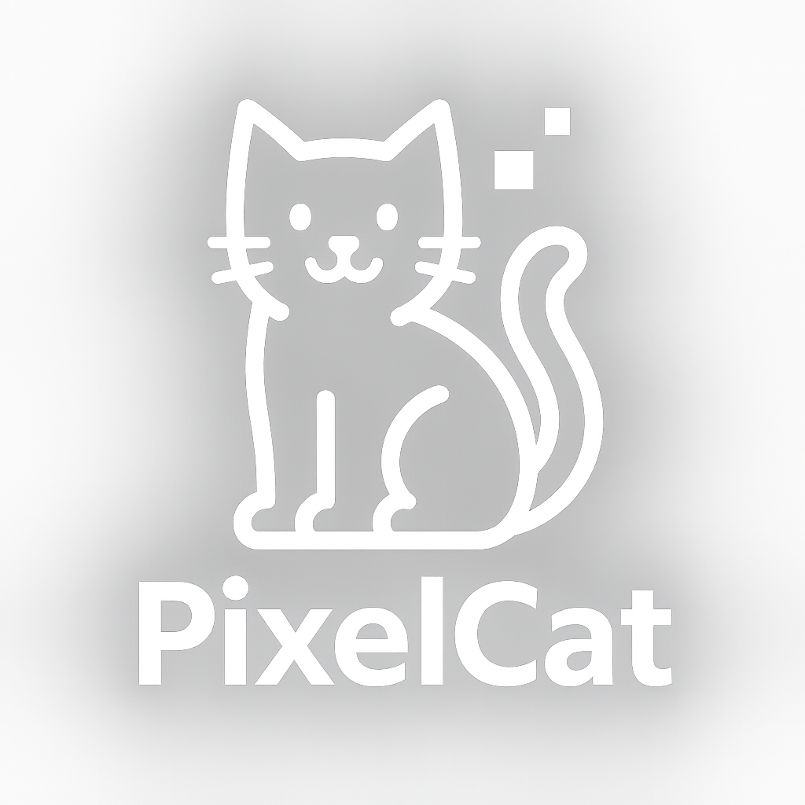
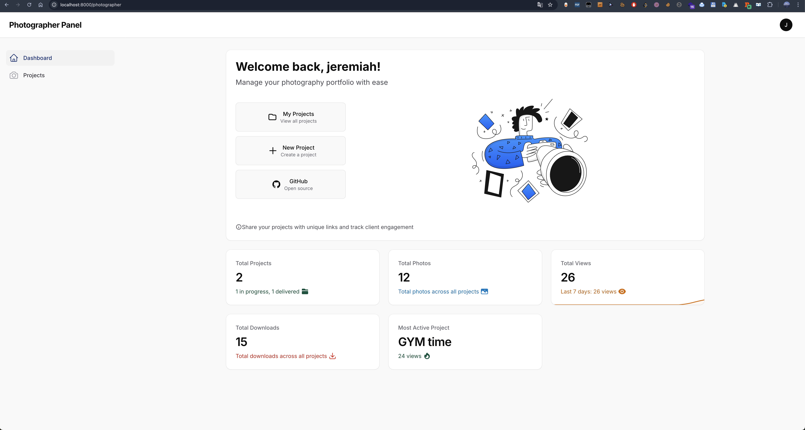
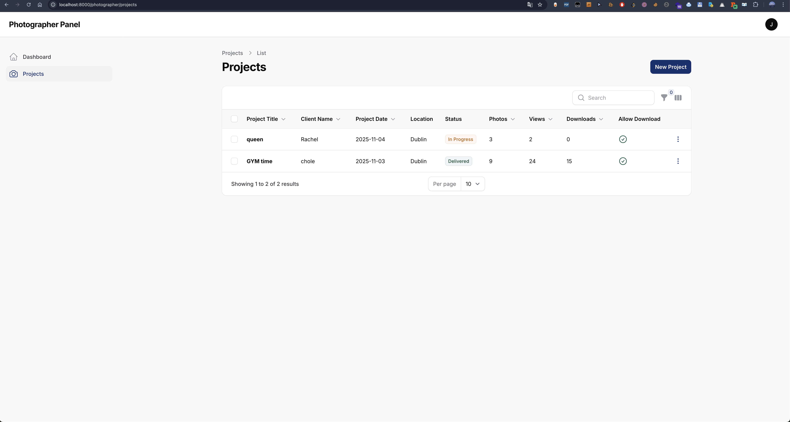
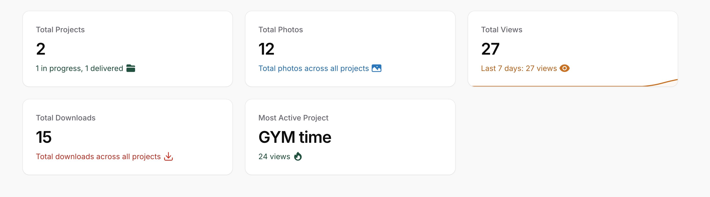

<div align="center">
  


  **Professional Photography Portfolio Management Platform**

  [](LICENSE)
  [](https://laravel.com)
  [](https://filamentphp.com)
  [](https://github.com/Jeremiah2077/PixelCat/pulls)

</div>

---

## 📸 Overview

PixelCat is a modern photography portfolio management platform built with Laravel 11 and Filament 3. It enables photographers to showcase their work, share projects with clients through secure links, and track engagement with detailed analytics.

## ✨ Key Features

### 🎨 Portfolio Management
- **Project Organization**: Create and manage photography projects with titles, descriptions, and categories
- **Photo Upload & Sorting**: Drag-and-drop photo uploads with custom ordering
- **Watermark Protection**: Automatic watermark application to protect your work
- **Secure Sharing**: Generate unique shareable links for each project

### 📊 Client Engagement
- **View Tracking**: Monitor how many times clients view your projects
- **Download Analytics**: Track photo downloads with detailed statistics
- **Access History**: View complete access logs with timestamps and IP addresses
- **Beautiful Gallery**: Client-friendly gallery with lightbox viewer (Viewer.js)

### 🎯 Photographer Dashboard
- **Welcome Widget**: Personalized dashboard with quick actions
- **Statistics Overview**: Real-time metrics for projects, photos, views, and downloads
- **Project Status**: Track in-progress and delivered projects
- **Activity Charts**: 7-day view trends with visual charts

### 🔒 Security & Privacy
- **Secure Token-based Sharing**: Unique, non-guessable project links
- **Photographer Authentication**: Separate photographer panel with role-based access
- **Status Management**: Control active/inactive photographer accounts
- **Password Protection**: Secure authentication with email verification

## 📷 Screenshots

<div align="center">

### Homepage

*Modern landing page showcasing PixelCat features*

### Photographer Dashboard

*Comprehensive dashboard with statistics and quick actions*

### Project Management

*Easy-to-use project management interface*

### Photo Gallery

*Beautiful client-facing gallery with lightbox viewer*

### Analytics

*Detailed view and download tracking*

</div>

## 🛠️ Tech Stack

- **Backend**: Laravel 11.x
- **Admin Panel**: Filament 3.3.43
- **PHP**: 8.2+
- **Database**: MySQL / PostgreSQL / SQLite
- **Frontend**:
  - Tailwind CSS
  - Alpine.js
  - Viewer.js (Image Gallery)
- **File Storage**: Local / S3 Compatible
- **Image Processing**: Intervention Image (Watermarking)

## 🚀 Quick Start

### Prerequisites
- PHP 8.2 or higher
- Composer
- Node.js & NPM
- MySQL/PostgreSQL (or SQLite for development)

### Installation

```bash
# Clone the repository
git clone https://github.com/Jeremiah2077/PixelCat.git
cd PixelCat

# Install PHP dependencies
composer install

# Install JavaScript dependencies
npm install

# Create environment file
cp .env.example .env

# Generate application key
php artisan key:generate

# Configure your database in .env
# DB_CONNECTION=mysql
# DB_HOST=127.0.0.1
# DB_PORT=3306
# DB_DATABASE=pixelcat
# DB_USERNAME=root
# DB_PASSWORD=

# Run migrations
php artisan migrate

# Create storage symlink
php artisan storage:link

# Build frontend assets
npm run build

# Start development server
php artisan serve
```

### Create Your First Photographer Account

```bash
# Register through the web interface at:
http://localhost:8000/photographer/register

# Or create via Filament user command:
php artisan make:filament-user
```

## 📖 Usage

### For Photographers

1. **Register Account**: Navigate to `/photographer/register`
2. **Verify Email**: Check your email for verification link
3. **Login**: Access your dashboard at `/photographer`
4. **Create Project**:
   - Click "New Project" button
   - Fill in title, description, and category
   - Set project status (In Progress / Delivered)
5. **Upload Photos**:
   - Open your project
   - Upload photos using drag-and-drop
   - Reorder photos by dragging
6. **Share with Clients**:
   - Copy the unique share link from project details
   - Send to your client
   - Monitor views and downloads in real-time

### For Clients

1. **Receive Link**: Get unique project link from photographer
2. **View Gallery**: Browse photos in beautiful gallery interface
3. **Download Photos**: Download individual photos or entire project as ZIP
4. **Responsive Design**: View on desktop, tablet, or mobile

## ⚙️ Configuration

### Watermark Setup

Place your watermark image at `public/watermark.png` or configure in `.env`:

```env
WATERMARK_PATH=public/watermark.png
WATERMARK_OPACITY=50
WATERMARK_POSITION=bottom-right
```

### Email Configuration

```env
MAIL_MAILER=smtp
MAIL_HOST=smtp.mailtrap.io
MAIL_PORT=2525
MAIL_USERNAME=your_username
MAIL_PASSWORD=your_password
MAIL_FROM_ADDRESS=noreply@pixelcat.com
MAIL_FROM_NAME="PixelCat"
```

### Storage Configuration

For production, configure S3 storage:

```env
FILESYSTEM_DISK=s3
AWS_ACCESS_KEY_ID=your_access_key
AWS_SECRET_ACCESS_KEY=your_secret_key
AWS_DEFAULT_REGION=us-east-1
AWS_BUCKET=your_bucket_name
```

## 📁 Project Structure

```
PixelCat/
├── app/
│   ├── Filament/
│   │   └── Photographer/          # Photographer panel
│   │       ├── Pages/             # Custom pages
│   │       ├── Resources/         # CRUD resources
│   │       └── Widgets/           # Dashboard widgets
│   ├── Http/
│   │   ├── Controllers/           # Controllers
│   │   └── Middleware/            # Custom middleware
│   ├── Models/                    # Eloquent models
│   │   ├── Photographer.php
│   │   ├── Project.php
│   │   ├── Photo.php
│   │   └── ProjectAccess.php
│   └── Providers/
│       └── Filament/              # Filament panel providers
├── database/
│   ├── migrations/                # Database migrations
│   └── seeders/                   # Seed data
├── resources/
│   └── views/
│       ├── home.blade.php         # Landing page
│       ├── gallery.blade.php      # Client gallery
│       └── filament/              # Filament custom views
├── public/
│   └── storage/                   # Symlinked storage
├── storage/
│   └── app/
│       └── public/
│           ├── photos/            # Original photos
│           └── watermarked/       # Watermarked photos
└── .github/
    └── screenshots/               # README screenshots (can be deleted)
```

## 🎨 Customization

### Theme Colors

The application uses a navy blue color scheme. To customize, edit:
- `app/Providers/Filament/PhotographerPanelProvider.php` - Filament panel colors
- `resources/views/home.blade.php` - Homepage colors
- Tailwind configuration for global styling

### Branding

- Logo: Replace `public/PixelCat.png`
- Favicon: Replace `public/favicon.ico`
- Brand Name: Update in panel provider

## 📊 Features Overview

| Feature | Description | Status |
|---------|-------------|--------|
| Project Management | Create, edit, delete photography projects | ✅ |
| Photo Upload | Drag-and-drop multi-photo upload | ✅ |
| Watermarking | Automatic watermark application | ✅ |
| Secure Sharing | Unique token-based project links | ✅ |
| View Tracking | Monitor project views | ✅ |
| Download Tracking | Track individual photo downloads | ✅ |
| ZIP Download | Download entire project as ZIP | ✅ |
| Analytics Dashboard | View statistics and charts | ✅ |
| Responsive Design | Mobile-friendly interface | ✅ |
| Dark Mode | Full dark mode support | ✅ |
| Email Verification | Secure photographer registration | ✅ |
| Password Reset | Self-service password recovery | ✅ |

## 🗺️ Roadmap

- [ ] Photo comments/feedback system
- [ ] Client favorites/selections
- [ ] Bulk photo operations
- [ ] Advanced filtering and search
- [ ] Photo metadata (EXIF) display
- [ ] Multiple photographer support (agencies)
- [ ] Payment integration for photo sales
- [ ] Custom branding per photographer
- [ ] Mobile app
- [ ] API for third-party integrations

## 🤝 Contributing

We welcome contributions! Here's how you can help:

1. Fork the repository
2. Create your feature branch (`git checkout -b feature/AmazingFeature`)
3. Commit your changes (`git commit -m 'Add some AmazingFeature'`)
4. Push to the branch (`git push origin feature/AmazingFeature`)
5. Open a Pull Request

### Development Guidelines

- Follow PSR-12 coding standards
- Write meaningful commit messages
- Add tests for new features
- Update documentation as needed
- Ensure all tests pass before submitting PR

## 🧪 Testing

```bash
# Run all tests
php artisan test

# Run with coverage
php artisan test --coverage

# Run specific test file
php artisan test tests/Feature/ProjectTest.php
```

## 📝 License

This project is open-sourced software licensed under the [MIT license](LICENSE).

## 💬 Support

- **Documentation**: [GitHub Wiki](https://github.com/Jeremiah2077/PixelCat/wiki)
- **Issues**: [GitHub Issues](https://github.com/Jeremiah2077/PixelCat/issues)
- **Discussions**: [GitHub Discussions](https://github.com/Jeremiah2077/PixelCat/discussions)

## 🙏 Acknowledgments

- [Laravel](https://laravel.com) - The PHP Framework
- [Filament](https://filamentphp.com) - Admin Panel Framework
- [Tailwind CSS](https://tailwindcss.com) - CSS Framework
- [Viewer.js](https://fengyuanchen.github.io/viewerjs/) - Image Gallery
- [Popsy Illustrations](https://illustrations.popsy.co) - Beautiful SVG Illustrations

## 📸 About

PixelCat was created to help photographers manage and share their work professionally. Whether you're a wedding photographer, portrait artist, or commercial photographer, PixelCat provides the tools you need to showcase your portfolio and engage with clients.

---

<div align="center">

**[⭐ Star this repo](https://github.com/Jeremiah2077/PixelCat)** if you find it helpful!

Made with ❤️ for Photographers

</div>
